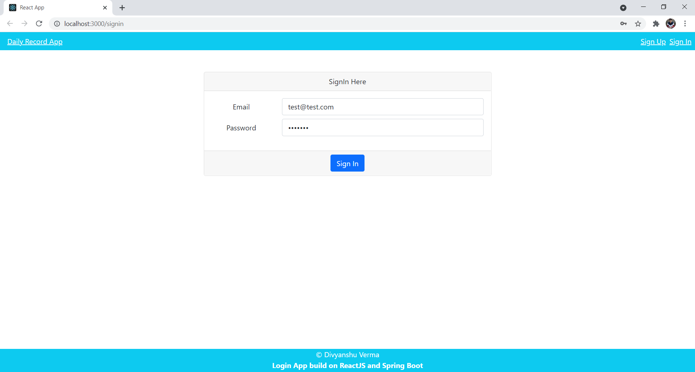
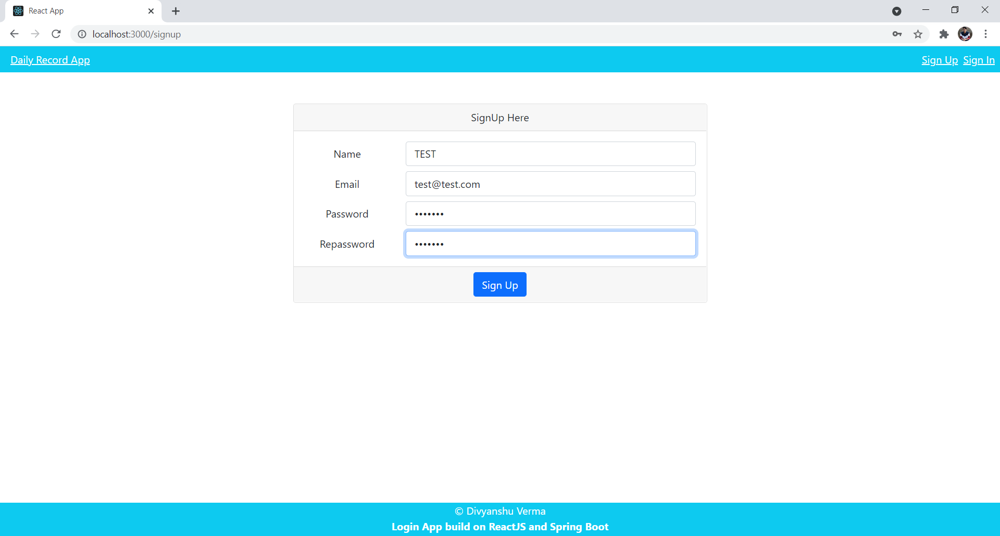
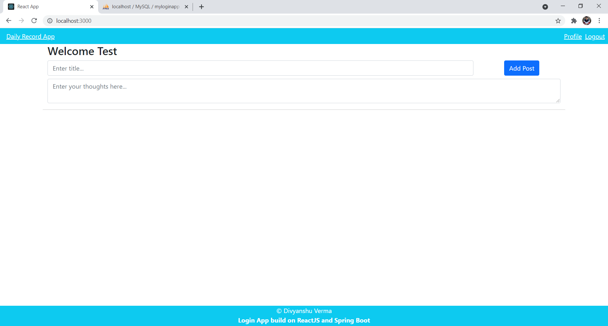
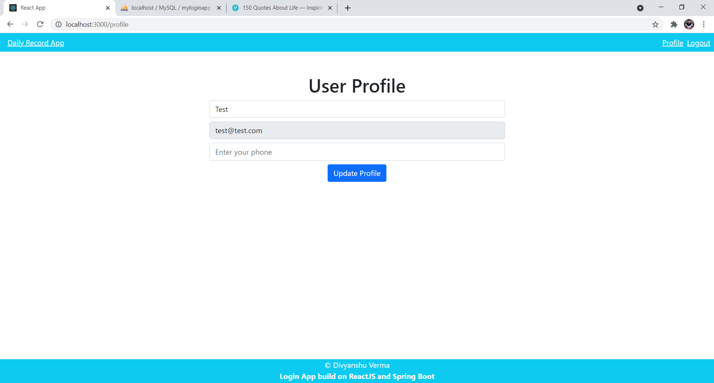
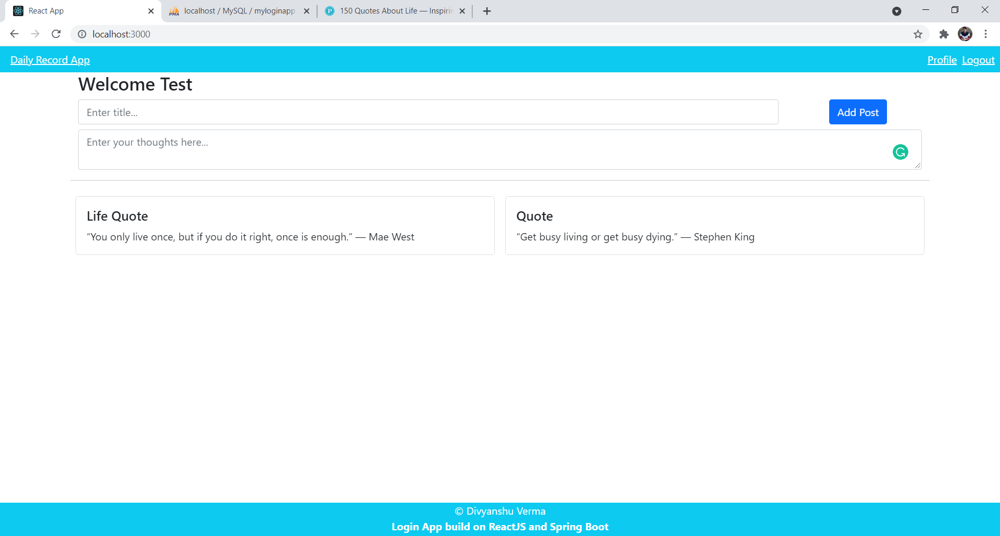

# ReactJS App with Spring Boot
Project frontend build with react js and backend with spring boot.
Implementation of Login and SignUp forms with various APIs and JWT Token for authentication.

**Used Technologies**
- Redux implementation
- Axios web call with headers.
- Login, Logout and LocalStorage with ReactJS.
- Handling JWT Token from React App.
- ReactJS
- Redux
- Spring Boot
- MySQL Database
- Table Name: Users,dailyrecords

**Thank You for your Attemtion**
Made by Karabekov Nurak
